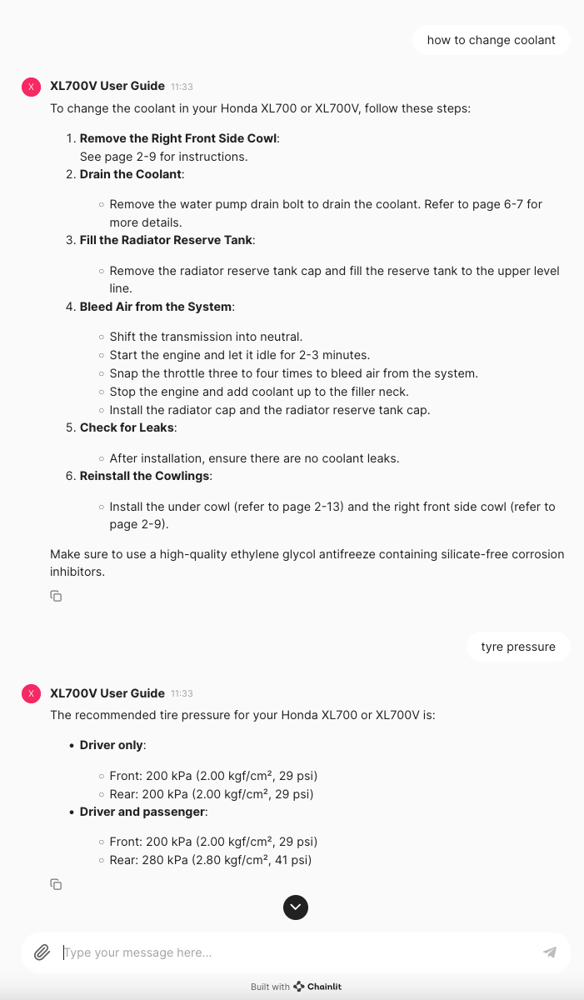

# Chainlit/Langchain/RAG/History Example App

## XL700V User Guide Chatbot

## Setup using Poetry

### Clone
Clone this repo and `cd` into the root directory in your terminal.

### Configure
Add you ChatGPT API Key to the `.env` file. API Keys can be obtained here: https://platform.openai.com/organization/api-keys

### Install
`poetry install --no-root`

### Run
`poetry run chainlit run src/app/app.py`

## About
Simple demo of a chatbot that:
 - Runs on [Chainlit](https://docs.chainlit.io/get-started/overview) using [LangChain](https://github.com/langchain-ai/langchain).
 - Uses custom data from a PDF loaded into a local Chroma vector store.
 - Has a chat history context for conversation support.
 