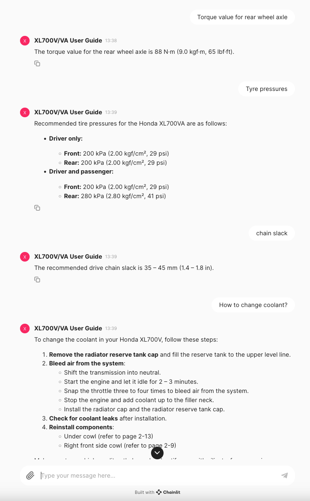

# Chainlit/LangChain/RAG/History Example App

## About
A simple demo of a chatbot that:
 - Runs on [Chainlit](https://docs.chainlit.io/get-started/overview) using [LangChain](https://github.com/langchain-ai/langchain).
 - Uses custom data from a PDF loaded into a local Chroma vector store.
 - Has a chat history context for conversation support.

## XL700V/VA User Guide Chatbot
The data loaded by this chatbot is a local PDF file in the data directory. The PDF file is a user guide for the Honda XL700V/VA (Transalp) motorbike.

You can ask the chatbot questions such as: `Torque value for rear wheel axle`

## Setup using Poetry

### Clone
Clone this repo and `cd` into the root directory in your terminal.

### Configure
Add you ChatGPT API Key to the `.env` file. API Keys can be obtained here: https://platform.openai.com/organization/api-keys

### Install
`poetry install --no-root`

### Run
`poetry run chainlit run src/app/app.py`

 